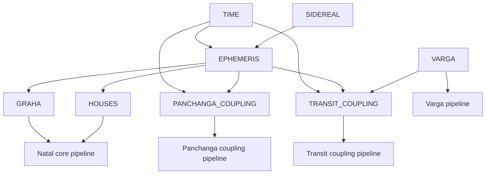
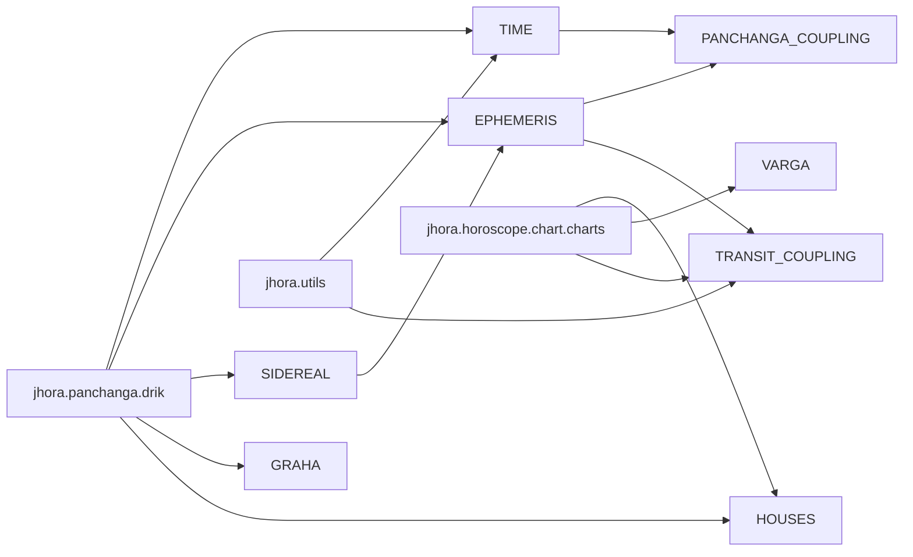
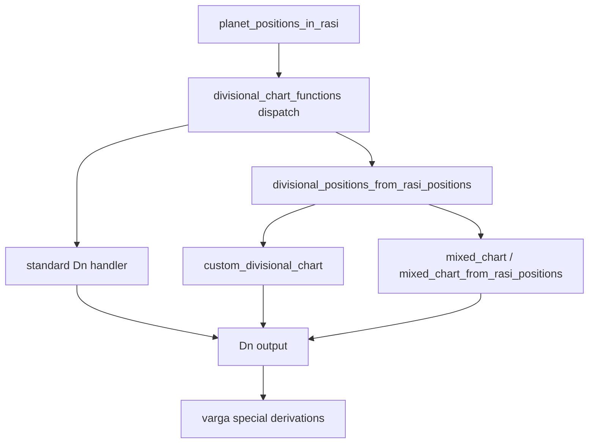

# core_computation_blueprint.v0.md

## 1) Scope

- FACT: This blueprint covers coupling-contract boundaries across TIME, EPHEMERIS, SIDEREAL, GRAHA, HOUSES, VARGA, PANCHANGA_COUPLING, and TRANSIT_COUPLING. [E01,E03,E05,E08,E14,E15,E23,E24,E25]
- FACT: This blueprint is limited to coupling-contract level for Panchanga and Transit and excludes full function-by-function catalogs. [E21, Source: `research/varga_divisional_charts/varga_transit_entry_dates/guru.md -> src/jhora/horoscope/chart/charts.py:L2013-L2068`]
- INFERENCE: Contract stability depends on explicit handling of time basis (`jd` vs `jd_utc`) at every engine boundary. [E01,E02,E03,E04,E24,E25]
- OPEN_QUESTION: Which boundary owns global sidereal mode reset when nested or direct-return paths are involved?

## 2) Engine blocks

- TIME
  - FACT: `jd_utc` is derived from local `jd` and timezone in multiple paths. [E02,E03,E24,E25]
  - FACT: `local_time_to_jdut1` uses `swe.utc_time_zone` and `swe.utc_to_jd(..., 0, ...)`. [E04]

- EPHEMERIS
  - FACT: Swiss Ephemeris integration points include `swe.calc_ut`, `swe.rise_trans`, and `swe.houses_ex`. [E05,E03,E24,E25]
  - FACT: ephemeris path is set at import through `swe.set_ephe_path`. [E07]

- SIDEREAL
  - FACT: `set_ayanamsa_mode` calls `swe.set_sid_mode` and mutates `const._DEFAULT_AYANAMSA_MODE`. [E08]
  - FACT: callsites include both `jd_utc` and `jd` as third argument forms. [E27,E28,E29,E30,E31,E32,E34]

- GRAHA
  - FACT: Rahu and Ketu are mapped to `swe.MEAN_NODE` and `-swe.MEAN_NODE`. [E13]
  - FACT: speed/state paths use `swe.calc_ut` vectors and index `longi[3]` for retrograde sign checks. [E16,E28,E31]

- HOUSES
  - FACT: house backend selection routes to `bhaava_madhya_kp` or `bhaava_madhya_swe`. [E15]
  - FACT: `planet_positions[0]` is used as Lagna base in bhava calculations. [E23]
  - FACT: `bhaava_madhya_kp` and `bhaava_madhya_swe` both return `swe.houses_ex(...)[0]`. [E24,E25]

- VARGA
  - FACT: standard varga dispatch is keyed by `divisional_chart_functions`. [Source: `research/varga_divisional_charts/core_varga_engine/guru.md -> src/jhora/horoscope/chart/charts.py:L44-L51`]
  - FACT: routing uses standard handlers when available, else `custom_divisional_chart` for factors in `1..MAX_DHASAVARGA_FACTOR`. [Source: `research/varga_divisional_charts/core_varga_engine/guru.md -> src/jhora/horoscope/chart/charts.py:L1066-L1077`; Source: `research/varga_divisional_charts/core_varga_engine/guru.md -> src/jhora/const.py:L726-L730`]
  - FACT: mixed composition uses two-stage chaining through `mixed_chart` / `mixed_chart_from_rasi_positions`. [Source: `research/varga_divisional_charts/custom_and_mixed_charts_dn_dmx_dn/guru.md -> src/jhora/horoscope/chart/charts.py:L1055-L1065`]

- PANCHANGA_COUPLING
  - FACT: `_get_tithi` anchors on `sunrise(jd, place)[2]`. [E21]
  - FACT: sunrise pipeline consumes `swe.rise_trans` with local timezone-adjusted JD path. [E03]

- TRANSIT_COUPLING
  - FACT: divisional and mixed entry-date paths iterate with step updates and use `utils.inverse_lagrange` for refinement. [Source: `research/varga_divisional_charts/varga_transit_entry_dates/guru.md -> src/jhora/horoscope/chart/charts.py:L2048-L2064`; Source: `research/varga_divisional_charts/varga_transit_entry_dates/guru.md -> src/jhora/utils.py:L631-L639`]
  - FACT: conjunction search in divisional path depends on repeated `divisional_chart(...)` evaluations under stepwise search. [Source: `research/varga_divisional_charts/varga_transit_entry_dates/guru.md -> src/jhora/horoscope/chart/charts.py:L2149-L2198`]

## 3) Canonical contracts (interfaces)

- FACT: `TimeContract`
  - Inputs: `jd`, `timezone`, and civil components where used.
  - Outputs: `jd_utc`, rise-local-time transforms, and UT1 conversion outputs.
  - Evidence: [E01,E02,E03,E04]

- FACT: `SiderealStateContract`
  - Inputs: `ayanamsa_mode`, optional `ayanamsa_value`, optional third argument (`jd` or `jd_utc` by callsite).
  - Outputs: global sidereal mode side effects via `swe.set_sid_mode` and `const._DEFAULT_AYANAMSA_MODE` mutation.
  - Evidence: [E08,E27,E28,E29,E30,E31,E32,E33,E34,E35,E36]

- FACT: `EphemerisContract`
  - Inputs: time basis (`jd_utc` or converted), flags, coordinates, and optional house system code.
  - Outputs: `calc_ut` vectors, `rise_trans` tuples, `houses_ex` cusps/ascmc.
  - Evidence: [E03,E05,E06,E07,E24,E25]

- FACT: `GrahaStateContract`
  - Inputs: planet id mapping and sidereal flags.
  - Outputs: longitude/speed vectors, retrograde sign, and Rahu/Ketu behavior.
  - Evidence: [E13,E16,E28,E31]

- FACT: `HousesContract`
  - Inputs: `jd`, `place`, house method/code, Lagna-indexed `planet_positions`.
  - Outputs: house cusps, Lagna-derived full longitude, assigned houses.
  - Evidence: [E14,E15,E23,E24,E25]

- FACT: `VargaContract`
  - Inputs: D factor, chart method, optional base/count controls, optional two-stage factors for mixed charts.
  - Outputs: varga planet-position arrays and derived varga families.
  - Evidence: [Source: `research/varga_divisional_charts/core_varga_engine/guru.md -> src/jhora/horoscope/chart/charts.py:L44-L51`; Source: `research/varga_divisional_charts/custom_and_mixed_charts_dn_dmx_dn/guru.md -> src/jhora/horoscope/chart/charts.py:L1012-L1077`]

- INFERENCE: Pipeline compatibility requires explicit contract adapters where one block outputs tuples and the next expects structured arrays.
- OPEN_QUESTION: Which contracts are pure functions versus stateful boundaries in runtime orchestration?

## 4) End-to-end pipelines

- FACT: Natal core (D1 + houses)
  - `rasi_chart` builds `planet_positions` with Lagna prefix.
  - `_bhaava_madhya_new` reads Lagna from index `0` and selects house backend.
  - Backend calls consume SwissEph house APIs.
  - Evidence: [E14,E15,E23,E24,E25]

- FACT: Varga pipeline (Dn + custom + mixed)
  - Dispatch map selects standard Dn handlers.
  - Routing chooses standard or custom path by factor and toggles.
  - Mixed chart composes stage-1 and stage-2 varga transforms.
  - Evidence: [Source: `research/varga_divisional_charts/core_varga_engine/guru.md -> src/jhora/horoscope/chart/charts.py:L44-L51`; Source: `research/varga_divisional_charts/custom_and_mixed_charts_dn_dmx_dn/guru.md -> src/jhora/horoscope/chart/charts.py:L1055-L1065`; Source: `research/varga_divisional_charts/custom_and_mixed_charts_dn_dmx_dn/guru.md -> src/jhora/horoscope/chart/charts.py:L1071-L1077`]

- FACT: Panchanga COUPLING pipeline (sunrise anchor + ephemeris consumption)
  - `sunrise` computes date-based `jd_utc`, calls `swe.rise_trans`, and returns `rise_jd` in local context.
  - `_get_tithi` consumes `sunrise(jd, place)[2]` as anchor input.
  - Evidence: [E03,E21]

- FACT: Transit COUPLING pipeline (stepping/search boundary + ephemeris/time consumption)
  - Divisional and mixed entry-date functions iterate on JD with precision thresholds.
  - Refinement uses inverse-lagrange on sampled points.
  - Divisional conjunction search loops through `divisional_chart` evaluations.
  - Evidence: [Source: `research/varga_divisional_charts/varga_transit_entry_dates/guru.md -> src/jhora/horoscope/chart/charts.py:L2013-L2068`; Source: `research/varga_divisional_charts/varga_transit_entry_dates/guru.md -> src/jhora/horoscope/chart/charts.py:L2076-L2121`; Source: `research/varga_divisional_charts/varga_transit_entry_dates/guru.md -> src/jhora/horoscope/chart/charts.py:L2122-L2201`; Source: `research/varga_divisional_charts/varga_transit_entry_dates/guru.md -> src/jhora/utils.py:L631-L639`]

- INFERENCE: End-to-end parity relies on preserving exact step-size and refinement behavior in transit-coupling paths.
- OPEN_QUESTION: Which pipeline boundaries expose deterministic outputs under unchanged sidereal global state?

## 5) Decision hooks map

- OPEN_QUESTION D01: Time basis ownership between `jd` and `jd_utc` at API boundaries.
- OPEN_QUESTION D02: Sidereal-mode lifecycle boundary for set/reset ownership.
- OPEN_QUESTION D03: Global-state isolation strategy when nested helpers call sidereal setters.
- OPEN_QUESTION D04: House backend selection exposure (`kp` vs `swe`) in public surface.
- OPEN_QUESTION D05: House output contract shape (`cusps` only vs cusps + ascmc bridge).
- OPEN_QUESTION D06: Lagna-index invariant enforcement for `planet_positions[0]`.
- OPEN_QUESTION D07: Graha state vector precision and rounding boundary.
- OPEN_QUESTION D08: Rahu/Ketu representation strategy at shared-model boundary.
- OPEN_QUESTION D09: Varga routing preference between standard and custom paths when both exist.
- OPEN_QUESTION D10: Custom Dn non-cyclic option exposure (`base_rasi`, variation, end-of-sign count).
- OPEN_QUESTION D11: Mixed-chart composition exposure (stage order and default factors).
- OPEN_QUESTION D12: Varga derivation family contract exposure (vaiseshikamsa/vimsopaka/vimsamsavarga).
- OPEN_QUESTION D13: Panchanga anchor contract around sunrise-dependent computations.
- OPEN_QUESTION D14: Transit stepping controls and precision contract surface.
- OPEN_QUESTION D15: Transit root-refinement contract and fallback behavior visibility.
- OPEN_QUESTION D16: Evidence traceability format for cross-block reproducibility stamps.

- OPEN_QUESTION VARGA_METHOD_HOOKS:
  - How chart_method values are surfaced for each Dn function family.
  - How pass-through method families are represented beside explicit-branch families.
  - How method-specific helper dependencies are documented for replay.

- OPEN_QUESTION PANCHANGA_COUPLING_HOOKS:
  - Which Panchanga outputs are treated as canonical anchors for downstream consumers.
  - Which sidereal/ephemeris states are part of Panchanga boundary context.

- OPEN_QUESTION TRANSIT_COUPLING_HOOKS:
  - Which step-size and precision controls are externally visible.
  - Which transit-coupling paths expose refinement diagnostics.

## 6) Risk register

- FACT: Mixed use of `jd` and `jd_utc` occurs across sidereal and house paths, including third-argument differences in `set_ayanamsa_mode` callsites. [E27,E28,E29,E30,E31,E32,E34]
- FACT: Some house and helper paths return without local `reset_ayanamsa_mode` in the same function body. [E29,E31]
- FACT: Transit-coupling search paths rely on iterative stepping and interpolation, which can vary with step parameters. [Source: `research/varga_divisional_charts/varga_transit_entry_dates/guru.md -> src/jhora/horoscope/chart/charts.py:L2033-L2064`; Source: `research/varga_divisional_charts/varga_transit_entry_dates/guru.md -> src/jhora/horoscope/chart/charts.py:L2091-L2121`]
- FACT: Varga routing includes both standard dispatch and custom path branching under max-factor ranges. [Source: `research/varga_divisional_charts/core_varga_engine/guru.md -> src/jhora/horoscope/chart/charts.py:L1066-L1077`; Source: `research/varga_divisional_charts/core_varga_engine/guru.md -> src/jhora/const.py:L726-L730`]
- FACT: Scope creep risk is present when coupling-level pipelines are expanded into full module enumerations; this file is constrained to boundary contracts and hooks only. [E21, Source: `research/varga_divisional_charts/varga_transit_entry_dates/guru.md -> src/jhora/horoscope/chart/charts.py:L2013-L2068`]

## 7) Mermaid diagrams

