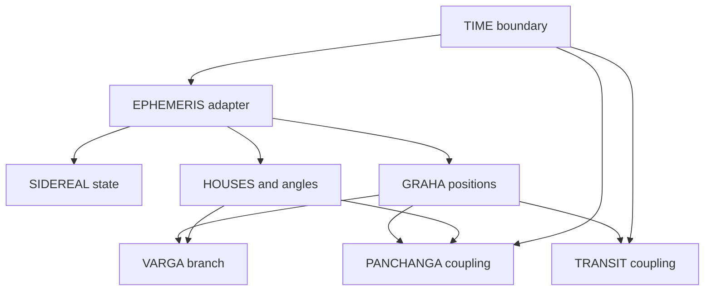
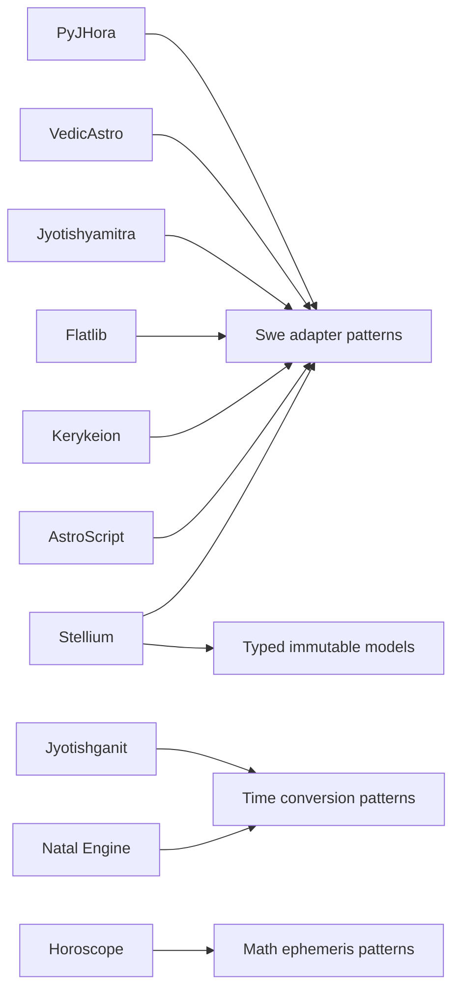
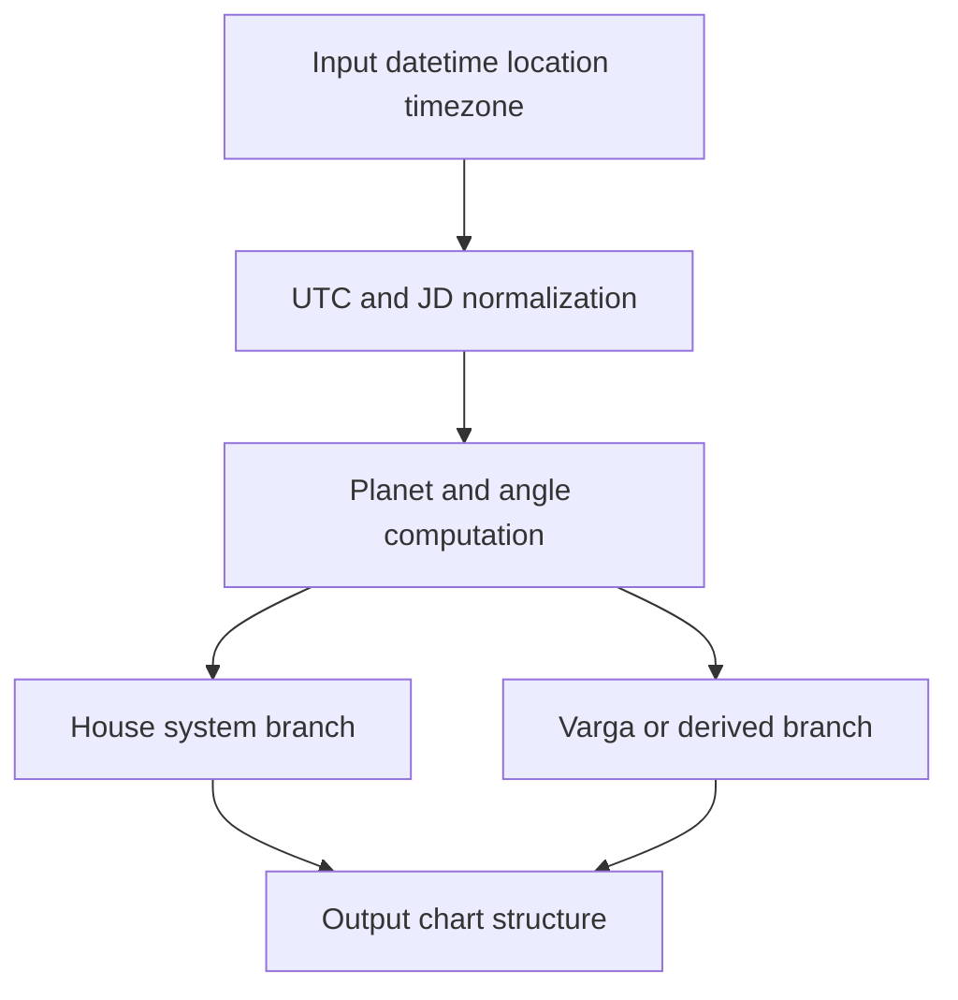

# Diba Architecture Options from Chart Engines

This document is evidence-first. FACTS use Sweep2 anchors, Diba research paths, or explicit project file pointers.

## Step 1 - Parity-critical constraints (FACTS)

- FACT: PyJHora separates local JD and UTC-based ephemeris calls with `jd_utc = jd - timezone/24` patterns.
  - Evidence: sweep_2_architecture_coupling_contract_map.md (E01, E02, E13).
- FACT: Sunrise flow is date anchored and uses Swiss Ephemeris rise/transit calls.
  - Evidence: sweep_2_architecture_coupling_contract_map.md (E03).
- FACT: Local time to JDUT1 helper behavior is defined in PyJHora utilities.
  - Evidence: sweep_2_architecture_coupling_contract_map.md (E04).
- FACT: Sidereal mode uses mutable Swiss Ephemeris state via set mode calls.
  - Evidence: sweep_2_architecture_coupling_contract_map.md (E08, E09, E26-E36).
- FACT: House calculations in PyJHora include paths with set-mode calls and non-uniform reset discipline.
  - Evidence: sweep_2_architecture_coupling_contract_map.md (E14, E15, E23, E24, E25).
- FACT: Varga dispatch includes standard, custom Dn, and mixed Dm x Dn composition.
  - Evidence: research/varga_divisional_charts/report.md.
  - Evidence: research/varga_divisional_charts/core_varga_engine/guru.md.

## Step 2 - Candidate engines (evidence bundles)

Ten projects are included: five Vedic-oriented and five Western/Tropical-oriented.

### Snapshot identity (FACTS)

- PyJHora - local root: D:\lab\Pyjhora - SHA256 manifest: research/chart_engines_local_inventory.md
- VedicAstro - local root: D:\lab\chart_engines_external\VedicAstro - commit SHA: a527866ea4df0c8293ea9c9c46fc4d6f57c0446a
- Jyotishganit - local root: D:\lab\jyotishganit - SHA256 manifest: research/chart_engines_local_inventory.md
- Jyotishyamitra - local root: D:\lab\jyotishyamitra - commit SHA: 86f7eb610a66b06b3f0817d2c53355bec8b3bf8d
- Horoscope (horoscope-gem) - local root: D:\lab\chart_engines_external\horoscope-gem - commit SHA: 5d49ce1556173774add4496bd9e1bda3be9bc9da
- Flatlib - local root: D:\lab\chart_engines_external\flatlib - commit SHA: fba89c72c13279c0709b0967a597427ee177665b
- Kerykeion - local root: D:\lab\kerykeion - SHA256 manifest: research/chart_engines_local_inventory.md
- AstroScript - local root: D:\lab\chart_engines_external\astro-script - commit SHA: fea061997b3d0141b2e434526734a23b357e2da1
- Natal Engine - local root: D:\lab\chart_engines_external\natal-engine - commit SHA: 3ac2afc4b6cb798700b811fb056d6ee5eab9472c
- Stellium - local root: D:\lab\stellium - commit SHA: d0fcaf2ec7b128a198c72c29f3f31da2f40c5d35

### Vedic engines

#### PyJHora (Baztaab/PyJHora)

- Source mode: LOCAL
- Eligibility (FACTS)
  - Evidence: src/jhora/panchanga/drik.py - planets_in_retrograde - computes planetary values using `swe.calc_ut`.
  - Evidence: src/jhora/panchanga/drik.py - bhaava_madhya_kp and bhaava_madhya_swe - computes houses and angles using `swe.houses_ex`.
- Evidence pointers
  - Evidence: src/jhora/panchanga/drik.py - module layout - panchanga computation entrypoints are co-located.
  - Evidence: src/jhora/horoscope/chart/charts.py - divisional_chart_functions - varga dispatch map layout.
  - Evidence: src/jhora/panchanga/drik.py - planets_in_retrograde - converts `jd` to `jd_utc` from timezone.
  - Evidence: src/jhora/utils.py - local_time_to_jdut1 - local time and timezone conversion to JDUT1.
  - Evidence: src/jhora/panchanga/drik.py - sidereal_longitude - uses `swe.calc_ut` with sidereal state setup.
  - Evidence: src/jhora/panchanga/drik.py - bhaava_madhya_kp and bhaava_madhya_swe - `swe.houses_ex` with sidereal state path.
  - Evidence: src/jhora/horoscope/chart/charts.py - rasi_chart - chart result structure and orchestration point.
  - Evidence: src/jhora/tests/pvr_tests.py - test harness - regression/parity style coverage exists.

#### VedicAstro (diliprk/VedicAstro)

- Source mode: LOCAL
- Eligibility (FACTS)
  - Evidence: vedicastro/VedicAstro.py - VedicHoroscopeData.generate_chart - builds chart data with planetary objects.
  - Evidence: vedicastro/horary_chart.py - find_exact_ascendant_time - uses `swe.houses_ex` for ascendant/house search.
- Evidence pointers
  - Evidence: vedicastro/VedicAstro.py - VedicHoroscopeData - main computation class layout.
  - Evidence: vedicastro/horary_chart.py - module layout - horary and ascendant search functions are separate.
  - Evidence: vedicastro/utils.py - get_utc_offset - timezone string and offset extraction.
  - Evidence: vedicastro/horary_chart.py - jd_to_datetime - JD to timezone-adjusted datetime conversion.
  - Evidence: vedicastro/VedicAstro.py - generate_chart - ephemeris-backed chart construction path.
  - Evidence: vedicastro/horary_chart.py - find_exact_ascendant_time - sidereal mode and `swe.houses_ex` loop path.
  - Evidence: vedicastro/VedicAstro.py - VedicHoroscopeData fields - input data model fields for birth/time/location.
  - Evidence: test_suite/horary_functions_test.py - run_horary_func_tests - test sweep script exists.

#### Jyotishganit

- Source mode: LOCAL
- Eligibility (FACTS)
  - Evidence: jyotishganit/core/astronomical.py - calculate_all_positions - computes planetary outputs.
  - Evidence: jyotishganit/core/astronomical.py - calculate_ascendant - computes ascendant/house anchor values.
- Evidence pointers
  - Evidence: jyotishganit/main.py - module layout - top-level orchestration entrypoint.
  - Evidence: jyotishganit/core/astronomical.py - module layout - time, ayanamsa, planetary, and ascendant functions grouped.
  - Evidence: jyotishganit/core/astronomical.py - skyfield_time_from_datetime - timezone-adjusted time construction.
  - Evidence: jyotishganit/tests/test_birth_charts.py - timezone checks - test cases include timezone offsets.
  - Evidence: jyotishganit/core/astronomical.py - get_ephemeris - ephemeris loading/caching path.
  - Evidence: jyotishganit/core/astronomical.py - get_timescale - shared time scale state path.
  - Evidence: jyotishganit/core/models.py - Person, Ayanamsa, Panchanga, PlanetPosition - typed dataclass model layer.
  - Evidence: jyotishganit/tests/test_birth_charts.py - test_birth_chart_* - test coverage for planets and houses.

#### Jyotishyamitra (VicharaVandana/jyotishyamitra)

- Source mode: LOCAL
- Eligibility (FACTS)
  - Evidence: support/mod_lagna.py - sidereal_longitude - computes planetary longitude with `swe.calc_ut`.
  - Evidence: support/mod_lagna.py - update_ascendant - computes lagna via `swe.houses_ex`.
- Evidence pointers
  - Evidence: support/mod_lagna.py - module layout - lagna and sidereal helpers are centralized.
  - Evidence: support/panchanga.py - module layout - panchanga computations call shared Swiss Ephemeris paths.
  - Evidence: support/mod_lagna.py - update_ascendant - `jd_utc` derivation from `jd` and timezone.
  - Evidence: support/panchanga.py - sidereal_longitude - UTC-oriented call path for planetary computation.
  - Evidence: support/mod_lagna.py - set_ayanamsa_mode/reset_ayanamsa_mode - mutable sidereal state wrappers.
  - Evidence: support/mod_lagna.py - swe.calc_ut and swe.houses_ex calls - direct ephemeris integration points.
  - Evidence: support/mod_general.py - constant arrays - internal modeling via fixed enumerations/constants.
  - Evidence: readme.md - project documentation text - no explicit automated tests or CI workflow instructions found.

#### Horoscope (horoscope-gem)

- Source mode: LOCAL
- Eligibility (FACTS)
  - Evidence: lib/horoscope/planet.rb - Planet.get_planets - computes planetary longitude/speed arrays.
  - Evidence: lib/horoscope.rb - Horoscope::Horo.compute - computes ascendant and house placement buckets.
- Evidence pointers
  - Evidence: lib/horoscope.rb - Horoscope::Horo - top-level compute/layout class.
  - Evidence: lib/horoscope/planet.rb - Planet module - planetary series/math layer layout.
  - Evidence: lib/horoscope.rb - compute - local time plus timezone conversion before julian-time use.
  - Evidence: lib/horoscope/planet.rb - get_jul_day - julian day conversion function.
  - Evidence: lib/horoscope/planet.rb - get_planets - planetary ephemeris series integration path.
  - Evidence: lib/horoscope/planet.rb - get_ayan - ayanamsa/state adjustment path.
  - Evidence: lib/horoscope.rb - positions and positions_rev - result modeling structures.
  - Evidence: spec/horoscope_spec.rb - RSpec examples - test coverage for compute and chart output.

### Western/Tropical engines

#### Flatlib (flatangle/flatlib)

- Source mode: LOCAL
- Eligibility (FACTS)
  - Evidence: flatlib/chart.py - Chart.__init__ - computes objects, houses, and angles in one chart call.
  - Evidence: flatlib/ephem/swe.py - sweHouses - computes houses and angles from Swiss Ephemeris.
- Evidence pointers
  - Evidence: flatlib/chart.py - Chart class - chart assembly layout.
  - Evidence: flatlib/ephem/swe.py - sweObject/sweHouses - ephemeris adapter layout.
  - Evidence: flatlib/datetime.py - Datetime.__init__ - computes JD from date/time/UTC offset.
  - Evidence: flatlib/datetime.py - Time.getUTC - explicit UTC conversion helper.
  - Evidence: flatlib/ephem/swe.py - sweObject - `calc_ut` integration for planets.
  - Evidence: flatlib/ephem/swe.py - sweHouses/sweNextTransit - houses and transit ephemeris integration paths.
  - Evidence: flatlib/object.py - object classes - chart object model layer.
  - Evidence: tests/test_chart.py - ChartTests - unit test coverage for chart behavior.

#### Kerykeion (g-battaglia/kerykeion)

- Source mode: LOCAL
- Eligibility (FACTS)
  - Evidence: kerykeion/astrological_subject_factory.py - _calculate_single_planet path - planetary computation and assignment.
  - Evidence: kerykeion/astrological_subject_factory.py - _calculate_houses - houses and angles via `swe.houses` or `swe.houses_ex`.
- Evidence pointers
  - Evidence: kerykeion/astrological_subject_factory.py - AstrologicalSubjectFactory - main chart factory layout.
  - Evidence: kerykeion/ephemeris_data_factory.py - EphemerisDataFactory - ephemeris series/batch layout.
  - Evidence: kerykeion/astrological_subject_factory.py - from_birth_data - timezone-aware input handling path.
  - Evidence: kerykeion/tests/test_utc.py - UTC behavior assertions - timezone/UTC checks.
  - Evidence: kerykeion/astrological_subject_factory.py - swe.set_sid_mode - sidereal state handling path.
  - Evidence: kerykeion/astrological_subject_factory.py - swe.houses and swe.houses_ex - ephemeris house integration path.
  - Evidence: kerykeion/kr_types/kr_models.py - typed schema models - structured modeling layer.
  - Evidence: tests/test_ephemeris_data_factory_complete.py - factory tests - automated coverage for planets/houses data generation.

#### AstroScript (Shoresh613/astro-script)

- Source mode: LOCAL
- Eligibility (FACTS)
  - Evidence: src/astroscript/positions.py - calculate_planet_positions - computes planetary longitudes and retrograde markers.
  - Evidence: src/astroscript/houses.py - calculate_house_positions - computes house cusps, Ascendant, and Midheaven.
- Evidence pointers
  - Evidence: src/astroscript/positions.py - module layout - planetary and object calculations in dedicated module.
  - Evidence: src/astroscript/houses.py - module layout - house computation module separation.
  - Evidence: src/astroscript/time_utils.py - convert_to_utc - timezone conversion helper.
  - Evidence: src/astroscript/houses.py - swe.julday with date/hour/minute - time to JD conversion path.
  - Evidence: src/astroscript/positions.py - swe.calc_ut - direct Swiss Ephemeris planetary integration.
  - Evidence: src/astroscript/houses.py - swe.houses and swe.set_topo - house engine and topocentric state calls.
  - Evidence: src/astroscript/constants.py - PLANETS/ASTEROIDS dictionaries - model/enumeration layer.
  - Evidence: README.md - Testing and Utilities section - no dedicated `tests/` directory; utility test script entry is documented.

#### Natal Engine (Unforced-Dev/natal-engine)

- Source mode: LOCAL
- Eligibility (FACTS)
  - Evidence: src/calculators/astronomy.js - calculateBirthPositions - computes planetary and angular positions.
  - Evidence: src/calculators/vedic.js - calculateVedic - computes ascendant-linked whole-sign houses.
- Evidence pointers
  - Evidence: src/calculators/astrology.js - calculateAstrology - western chart assembly layout.
  - Evidence: src/calculators/vedic.js - calculateVedic - sidereal chart layout for Vedic path.
  - Evidence: src/calculators/astronomy.js - calculateBirthPositions - local hour plus timezone to UT conversion.
  - Evidence: src/calculators/utils.js - parseDateComponents - date parsing to avoid timezone drift.
  - Evidence: src/calculators/astronomy.js - astronomy-engine integration - planetary ephemeris backend path.
  - Evidence: src/calculators/vedic.js - tropicalToSidereal and ayanamsa functions - sidereal state and conversion path.
  - Evidence: src/calculators/astrology.js - returned `planets`, `aspects`, `elements`, `modalities` - chart data modeling structure.
  - Evidence: tests/accuracy.test.js and tests/vedic.test.js - node test coverage for accuracy and house outcomes.

#### Stellium (katelouie/stellium)

- Source mode: LOCAL
- Eligibility (FACTS)
  - Evidence: src/stellium/engines/ephemeris.py - ephemeris engine calls - planetary computation path.
  - Evidence: src/stellium/engines/houses.py - _calculate_swiss_houses - house cusp and angle computation path.
- Evidence pointers
  - Evidence: src/stellium/core/builder.py - ChartBuilder - orchestration layout for chart pipelines.
  - Evidence: src/stellium/engines - module package layout - separate ephemeris/houses/aspects engines.
  - Evidence: src/stellium/utils/time.py - datetime_to_julian_day - UTC normalization behavior.
  - Evidence: src/stellium/core/models.py - ChartLocation.timezone and DateTimeInfo validation - timezone-aware modeling.
  - Evidence: src/stellium/engines/ephemeris.py - swe.set_sid_mode - sidereal mode ephemeris state path.
  - Evidence: src/stellium/engines/houses.py - swe.houses_ex path - house engine ephemeris integration.
  - Evidence: src/stellium/core/models.py - dataclass model set including CalculatedChart - typed immutable model layer.
  - Evidence: tests/test_chart_builder.py and tests/test_house_systems.py - automated test coverage for chart and houses.

## Step 3 - Transferable patterns

- FACT: Mutable ephemeris sidereal state appears in PyJHora and other Swiss Ephemeris adapters.
  - Evidence: sweep_2_architecture_coupling_contract_map.md (E08, E24, E25, E26-E36).
  - Evidence: src/stellium/engines/ephemeris.py - swe.set_sid_mode - sidereal state call path.
  - Evidence: kerykeion/astrological_subject_factory.py - swe.set_sid_mode - sidereal state call path.
- FACT: UTC conversion is explicit in all ten bundles.
  - Evidence: Step 2 evidence pointers for each project time/tz entries.
- FACT: Houses/angles computation is explicit in all ten bundles.
  - Evidence: Step 2 eligibility pointers for each project.

## Step 4 - Diba architecture options

### Option 1 - Functional pipelines with scoped state wrappers

- FACTS
  - Evidence: sweep_2_architecture_coupling_contract_map.md (E08, E24, E25, E26-E36).
  - Evidence: src/jhora/panchanga/drik.py - set/reset sidereal mode patterns in multiple call paths.
- INFERENCE
  - A function-first pipeline can isolate sidereal-state write windows and preserve parity boundaries from Step 1.
- OPEN_QUESTION
  - Probe: run repeated mixed calls of `sidereal_longitude`, `bhaava_madhya_kp`, and `bhaava_madhya_swe` and compare result stability under concurrent execution.

### Option 2 - Object graph with explicit engine dependencies

- FACTS
  - Evidence: src/stellium/core/builder.py - ChartBuilder - explicit dependency assembly.
  - Evidence: kerykeion/ephemeris_data_factory.py - factory-driven series generation.
- INFERENCE
  - A dependency graph can centralize ephemeris adapter setup while keeping time and house engines separately testable.
- OPEN_QUESTION
  - Probe: build one minimal chart path with injected time, ephemeris, and houses adapters and compare with Sweep2 parity anchors.

### Option 3 - Stateful engine snapshots with immutable outputs

- FACTS
  - Evidence: src/stellium/core/models.py - CalculatedChart dataclass and frozen model patterns.
  - Evidence: sweep_2_architecture_coupling_contract_map.md (E01-E04, E14-E15, E23-E25).
- INFERENCE
  - Snapshot outputs can preserve deterministic replay of JD/JD_UTC and house-result boundaries when stateful ephemeris adapters are used.
- OPEN_QUESTION
  - Probe: execute the same input batch twice with snapshot persistence and check byte-level equality of serialized outputs.

## Mermaid diagrams

## Quality Gate Report

- project count: 10 total (5 vedic plus 5 western)
- mermaid blocks count: 3
- raw url scan result: 0 hits
- command #1 phrase scan result: 0 hits
- tables scan result: 0 hits

