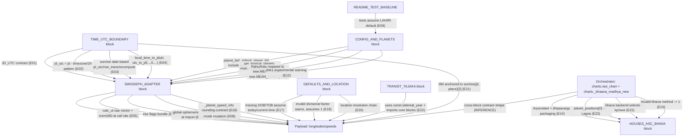

# sweep_2_architecture_coupling_contract_map.md — Blueprint-grade (final polished)

## Snapshot identity (FACTS)

- Local source root used for this extraction:
  - `pyjhora_root = D:\lab\Pyjhora`
- Repo-relative file mapping used for evidence line numbers:
  - `src/jhora/panchanga/drik.py` ↔ `D:\lab\Pyjhora\src\jhora\panchanga\drik.py`
  - `src/jhora/utils.py` ↔ `D:\lab\Pyjhora\src\jhora\utils.py`
  - `src/jhora/const.py` ↔ `D:\lab\Pyjhora\src\jhora\const.py`
- Git identity availability:
  - FACT: Local file validation in this document was performed against `D:\lab\Pyjhora`.
- Reproducibility method (choose one):
  - If you have a git clone locally (e.g., `D:\lab\PyJHora\` or equivalent), record the exact commit SHA via:
    - `git rev-parse HEAD`
  - If git SHA is not available, record file digests (SHA256) via:
    - `sha256sum src/jhora/panchanga/drik.py src/jhora/utils.py src/jhora/const.py`
- Recorded SHA256 digests for this snapshot (FACTS):
  - `src/jhora/panchanga/drik.py` — `9790dcdf442910b1eaa260b16c346c6696438eb6955c0a520c1be220ba3497bc`
  - `src/jhora/utils.py` — `861062b3abba1655b9d4e5608333f8aaa1d391b3d38ecdacbac565bf930f3875`
  - `src/jhora/const.py` — `2dacc910fce9babc69582491b52cde9fd23ab9dde835d41efb65fc0f79e00ba8`

---

## Scope and constraints (NON_BINDING)

- This document is a coupling + contract map extracted code-first from the above snapshot.
- No technical policy decisions are locked here.
- Every non-trivial statement is separated into:
  - **FACTS (evidence-backed)**
  - **INFERENCES (labeled)**

---

## Evidence index (anchor IDs)

- E01 — `drik.sidereal_longitude()` docstring: JD_UTC requirement + conversion relation
- E02 — `drik.planets_in_retrograde()`: `jd_utc = jd - tz/24` observed pattern
- E03 — `drik.sunrise()`: date-based `jd_utc`, `rise_trans`, recomputed `rise_jd`
- E04 — `utils.local_time_to_jdut1()`: `utc_time_zone`, `utc_to_jd(..., seconds=0, ...)` + comment
- E05 — `drik.sidereal_longitude()`: `swe.calc_ut(...)` returns raw vector `longi`, call site normalizes via `utils.norm360`
- E06 — `drik._rise_flags`: rise/set flags include `BIT_HINDU_RISING | FLG_TRUEPOS | FLG_SPEED`
- E07 — `const`: import-time global `swe.set_ephe_path(_ephe_path)`
- E08 — `drik.set_ayanamsa_mode()`: calls `swe.set_sid_mode`, mutates `const._DEFAULT_AYANAMSA_MODE`
- E09 — `README`: tests assume `const._DEFAULT_AYANAMSA_MODE='LAHIRI'`
- E10 — `drik`: module-global `planet_list` and `_sideral_planet_list` include Rahu/Ketu; list may expand to outer planets
- E11 — `drik.set_tropical_planets()`: mutates module-global `planet_list`
- E12 — `drik1`: explicit experimental warning
- E13 — `const`: Rahu/Ketu mapped to `swe.MEAN_NODE` / `-swe.MEAN_NODE`
- E14 — `charts.rasi_chart()`: orchestrates ascendant + dhasavarga and packages `planet_positions` with Lagna prefix
- E15 — `charts._bhaava_madhya_new()`: selects house backend `drik.bhaava_madhya_kp` or `drik.bhaava_madhya_swe`
- E16 — `drik._planet_speed_info()`: rounds raw `swe.calc_ut` vector with fixed precisions
- E17 — `utils._validate_data()`: assumes today/current time when missing inputs
- E18 — `utils._validate_data()`: invalid divisional factor warns and assumes `1`
- E19 — `charts._bhaava_madhya_new()`: invalid bhava method warns and assumes `1`
- E20 — `utils.get_location()` docstring: place resolution chain (IP → DB → Google scrape → Nominatim → [])
- E21 — `drik._get_tithi()`: tithi anchored to `sunrise(jd, place)[2]`
- E22 — `tajaka`: transit/return module uses `const.sidereal_year` and imports core blocks
- E23 — `charts._bhaava_madhya_new()`: uses `planet_positions[0]` (Lagna) to compute `ascendant_full_longitude`

---

## STEP 1 — Coupling Radar (cross-cutting concerns)

### 1) Time representation (JD vs JD_UTC, timezone offset usage, DST ambiguity)

- Parity sensitivity: **PARITY_CRITICAL**

#### FACTS (evidence-backed)

- `drik.sidereal_longitude(jd_utc, planet)` documents UTC-date/time JD usage and gives the relation `JD_UTC = JD - Place.TimeZoneInFloatHours`.
  - Evidence (E01):
    - `src/jhora/panchanga/drik.py` L204–L216 — docstring defines JD_UTC expectation and conversion (commit SHA not available in snapshot)
  - Excerpt:
    ```python
    def sidereal_longitude(jd_utc, planet):
        """
              All other functions of this PyJHora library will require JD and not JD_UTC
              JD_UTC = JD - Place.TimeZoneInFloatHours
              For example for India JD_UTC = JD - 5.5. For wester time zone -5.0 it JD_UTC = JD - (-5.0)
    ```

- A common call-site pattern computes `jd_utc` from a local-JD `jd` and timezone hours.
  - Evidence (E02):
    - `src/jhora/panchanga/drik.py` L233–L245 — `planets_in_retrograde()` computes `jd_utc = jd - place.timezone/24` (commit SHA not available)
  - Excerpt:
    ```python
    def planets_in_retrograde(jd,place):
        """
            To get the list of retrograding planets
            @param jd: julian day number (not UTC)
            @param place: Place as struct ('Place',latitude,longitude,timezone)
            @return: list of retrograding planets e.g. [3,5]
            NOTE: To find the retrograding planets for kundali charts use this function.
            There is another function in `jhora.horoscope.chart.charts` module which calculates
            retrograding planet based on their positions and is used in yoga, dhasa calculations
        """
        jd_utc = jd - place.timezone / 24.
        flags = swe.FLG_SWIEPH | swe.FLG_SIDEREAL | _rise_flags
        set_ayanamsa_mode(_ayanamsa_mode,_ayanamsa_value,jd)
    ```

- `drik.sunrise(jd, place)`:
  - Converts `jd` → Gregorian date, then constructs `jd_utc` for that date (at 00:00) via `utils.gregorian_to_jd(Date(y,m,d))`.
  - Calls `swe.rise_trans(jd_utc - tz/24, ...)`.
  - Recomputes `rise_jd` via `utils.julian_day_number(dob, tob)` using the derived local rise time.
  - Evidence (E03):
    - `src/jhora/panchanga/drik.py` L352–L365 — sunrise computes date-based `jd_utc`, uses `rise_trans`, then recomputes `rise_jd` (commit SHA not available)
  - Excerpt:
    ```python
        y, m, d,_  = jd_to_gregorian(jd)
        jd_utc = utils.gregorian_to_jd(Date(y, m, d))
        _,lat, lon, tz = place
        result = swe.rise_trans(jd_utc - tz/24, swe.SUN, geopos=(lon, lat,0.0),
                                rsmi = _rise_flags + swe.CALC_RISE)
        rise_jd = result[1][0]
        rise_local_time = (rise_jd - jd_utc) * 24 + tz
        tob = tuple(utils.to_dms(rise_local_time, as_string=False))
        rise_jd = utils.julian_day_number(dob, tob)
    ```

- A helper exists to compute JD(UT1) from local time:
  - Uses `swe.utc_time_zone(...)` to transform civil time.
  - Calls `swe.utc_to_jd(...)` with the seconds argument passed as `0`.
  - Evidence (E04):
    - `src/jhora/utils.py` L715–L720 — `utc_to_jd(..., 0, ...)` call (commit SHA not available)
  - Excerpt:
    ```python
    def local_time_to_jdut1(year, month, day, hour = 0, minutes = 0, seconds = 0, timezone = 0.0):
      y, m, d, h, mnt, s = swe.utc_time_zone(year, month, day, hour, minutes, seconds, timezone)
      jd_et, jd_ut1 = swe.utc_to_jd(y, m, d, h, mnt, 0, flag = swe.GREG_CAL)
      return jd_ut1
    ```

#### INFERENCES (labeled)

- INFERENCE (NON_BINDING): Because both `JD` and `JD_UTC` appear as required inputs across functions (E01) and common patterns exist (E02), a shared time boundary likely carries both representations explicitly.
- UNCERTAIN: DST fold/gap behavior cannot be concluded from the call sites alone; runtime probes are needed to characterize how ambiguous/nonexistent local times are handled.
- UNCERTAIN (E04 comment): In-code “BUG …” commentary (if present) is not primary proof; it requires a minimal runtime reproduction or upstream issue/PR reference before it can justify any policy.

---

### 2) Swiss Ephemeris call contracts (calc_ut / rise_trans flags, ephemeris path, time scale expectations)

- Parity sensitivity: **PARITY_CRITICAL**

#### FACTS (evidence-backed)

- In sidereal mode, `sidereal_longitude()`:
  - Calls `swe.calc_ut(jd_utc, planet, flags=...)` returning a raw vector `longi`.
  - Returns `utils.norm360(longi[0])` at the call site.
  - Evidence (E05):
    - `src/jhora/panchanga/drik.py` L222–L232 — raw vector `longi` from `calc_ut`, normalization applied in `sidereal_longitude` (commit SHA not available)
  - Excerpt:
    ```python
    if const._TROPICAL_MODE:
        flags = swe.FLG_SWIEPH
    else:
        flags = swe.FLG_SWIEPH | swe.FLG_SIDEREAL | _rise_flags
        #set_ayanamsa_mode(_ayanamsa_mode,_ayanamsa_value,jd)
        set_ayanamsa_mode(_ayanamsa_default,_ayanamsa_value,jd_utc); _ayanamsa_mode = const._DEFAULT_AYANAMSA_MODE
        #print('drik sidereal long ayanamsa',_ayanamsa_mode, const._DEFAULT_AYANAMSA_MODE)
        #import inspect; print('called by',inspect.stack()[1].function)
    longi,_ = swe.calc_ut(jd_utc, planet, flags = flags)
    reset_ayanamsa_mode()
    return utils.norm360(longi[0]) # degrees
    ```

- Rise/set flags include Hindu rising, true position, and speed.
  - Evidence (E06):
    - `src/jhora/panchanga/drik.py` L50–L53 — `_rise_flags` definition (commit SHA not available)
  - Excerpt:
    ```python
    _rise_flags = swe.BIT_HINDU_RISING | swe.FLG_TRUEPOS | swe.FLG_SPEED # V3.2.3 # Speed flag added for retrogression
    ```

- Swiss Ephemeris data path is set globally at import time via `swe.set_ephe_path(_ephe_path)`.
  - Evidence (E07):
    - `src/jhora/const.py` L174–L175 — `set_ephe_path` at import (commit SHA not available)
  - Excerpt:
    ```python
    _ephe_path = os.path.abspath(_EPHIMERIDE_DATA_PATH)
    swe.set_ephe_path(_ephe_path)
    ```

#### INFERENCES (labeled)

- INFERENCE (NON_BINDING): A stable ephemeris adapter boundary should expose raw SwissEph vectors and let parity-critical normalization happen exactly where PyJHora does it (e.g., `sidereal_longitude()` uses `norm360`, E05).
- INFERENCE (NON_BINDING): Provenance likely records the effective flags bundle (E05–E06) and ephe path (E07).

---

### 9) Provenance and reproducibility (tests, defaults, external dependencies)

- Parity sensitivity: **PARITY_IMPORTANT (repro/diagnostics)**

#### FACTS (evidence-backed)

- README documents a large test suite and that tests assume Lahiri default (E09).
- `get_location()` documents a multi-step place resolution chain including IP lookup, DB, Google scraping, and Nominatim (E20).

#### INFERENCES (labeled)

- INFERENCE (NON_BINDING): A minimal provenance stamp likely needs to record:
  - effective ayanamsa mode (E08, E09)
  - ephemeris path (E07)
  - place resolution method/source (E20)
  - assumed defaults (E17–E19)

---

## STEP 2 — Engine Blocks (tightly-coupled clusters)

### Block E — HOUSES_ASC_BHAVA

#### FACTS (evidence-backed)

- House backend selection delegates to `drik.bhaava_madhya_kp` / `drik.bhaava_madhya_swe` (E15).
- House assignment logic assumes `planet_positions[0]` is Lagna (E23).
- House assignment logic therefore uses Lagna from `planet_positions` and delegates to a `drik.*` backend (E15, E23).
- Invalid bhava method defaults to `1` (E19).

---

## Evidence re-validation ledger (local tree)

- E01: verified.
  - `src/jhora/panchanga/drik.py` L204–L216
- E02: verified.
  - `src/jhora/panchanga/drik.py` L233–L245
- E03: verified.
  - `src/jhora/panchanga/drik.py` L352–L365
- E04: verified.
  - `src/jhora/utils.py` L715–L720
- E05: verified.
  - `src/jhora/panchanga/drik.py` L222–L232
- E06: verified.
  - `src/jhora/panchanga/drik.py` L50–L53
- E07: verified.
  - `src/jhora/const.py` L174–L175
- E08: verified.
  - `src/jhora/panchanga/drik.py` L117–L149
- E09: verified.
  - `src/jhora/README.md` L17–L17
- E10: verified.
  - `src/jhora/panchanga/drik.py` L42–L47
- E11: verified.
  - `src/jhora/panchanga/drik.py` L55–L57
- E12: verified.
  - `src/jhora/panchanga/drik1.py` L22–L24
- E13: verified.
  - `src/jhora/const.py` L53–L54
- E14: verified.
  - `src/jhora/horoscope/chart/charts.py` L95–L107
- E15: verified.
  - `src/jhora/horoscope/chart/charts.py` L164–L164
- E16: verified.
  - `src/jhora/panchanga/drik.py` L254–L264
- E17: verified.
  - `src/jhora/utils.py` L135–L141
- E18: verified.
  - `src/jhora/utils.py` L142–L147
- E19: verified.
  - `src/jhora/horoscope/chart/charts.py` L136–L139
- E20: verified.
  - `src/jhora/utils.py` L153–L157
- E21: verified.
  - `src/jhora/panchanga/drik.py` L482–L482
- E22: verified.
  - `src/jhora/horoscope/transit/tajaka.py` L22–L25
- E23: verified.
  - `src/jhora/horoscope/chart/charts.py` L140–L141

---

## Evidence index addendum (anchor IDs)

- E24 — `drik.bhaava_madhya_kp()`: jd basis, flags, SwissEph house API call, set/reset behavior
- E25 — `drik.bhaava_madhya_swe()`: house code to `hsys`, jd basis, flags, SwissEph output index usage, set/reset behavior
- E26 — `set_ayanamsa_mode(` callsite scan over `src/jhora/*.py`: command and inventory summary
- E27 — callsite pattern: `set_ayanamsa_mode(_ayanamsa_default,_ayanamsa_value,jd_utc)` with in-function reset
- E28 — callsite pattern: `set_ayanamsa_mode(_ayanamsa_mode,_ayanamsa_value,jd)` in retrograde/speed flows
- E29 — callsite pattern: `set_ayanamsa_mode(_ayanamsa_mode,_ayanamsa_value,jd) # needed for swe.houses_ex()` in house functions
- E30 — callsite pattern: `set_ayanamsa_mode(_ayanamsa_mode,_ayanamsa_value,jd)` in `ascendant()` with in-function reset
- E31 — callsite pattern: `set_ayanamsa_mode(_ayanamsa_mode,_ayanamsa_value,jd)` inside nested helper `_get_planet_longitude_sign()`
- E32 — callsite pattern: UI conditional/jd-keyword call form for `SUNDAR_SS`
- E33 — callsite pattern: external one-arg mode set (`'SURYASIDDHANTA'`, `'RAMAN'`, `'LAHIRI'`, variable mode)
- E34 — callsite pattern: `drik.set_ayanamsa_mode(ayan, ayanamsa_value, jd)` and `drik.set_ayanamsa_mode(drik._ayanamsa_mode,drik._ayanamsa_value,jd)`
- E35 — callsite pattern: `panchanga.set_ayanamsa_mode(ayanamsa_mode=const._DEFAULT_AYANAMSA_MODE)`
- E36 — callsite pattern: `set_ayanamsa_mode(self._ayanamsa_mode)` and `set_ayanamsa_mode(ayanamsa_mode, ayanamsa_value, jd)` in `drik1.py`

---

## Blueprint-critical evidence addendum (FACTS only)

### FACTS — houses API contracts

- `bhaava_madhya_kp()` computes `jd_utc` as `jd - (tz / 24.)`, sets sidereal flags when non-tropical, calls `set_ayanamsa_mode(..., jd)`, and returns `swe.houses_ex(...)[0]` (cusps list). No `reset_ayanamsa_mode()` call exists in the function body.
  - Evidence (E24):
    - `src/jhora/panchanga/drik.py` L1438–L1447
    - `src/jhora/panchanga/drik.py` L1448–L1451
  - Excerpt A:
    ```python
    def bhaava_madhya_kp(jd,place):
        """
            Compute the mid angle / cusp of each of each house.
            0th element is ascendant, 9th element is mid-heaven (mid coeli) etc
        """
        global _ayanamsa_mode,_ayanamsa_value
        _, lat, lon, tz = place
        jd_utc = jd - (tz / 24.)
        if const._TROPICAL_MODE:
    ```
  - Excerpt B:
    ```python
            flags = swe.FLG_SWIEPH
        else:
            flags = swe.FLG_SIDEREAL
            set_ayanamsa_mode(_ayanamsa_mode,_ayanamsa_value,jd) # needed for swe.houses_ex()
        return list(swe.houses_ex(jd_utc, lat, lon, flags = flags)[0])
    ```

- `bhaava_madhya_swe()` validates `house_code`, converts to ASCII bytes via `hsys = bytes(...)`, computes `jd_utc` as `jd - (tz / 24.)`, sets sidereal flags when non-tropical, calls `set_ayanamsa_mode(..., jd)`, and returns `swe.houses_ex(...)[0]` (cusps list). No `reset_ayanamsa_mode()` call exists in the function body.
- Nearby `ascendant()` call shows `swe.houses_ex(...)[1][0]` usage (ascmc index path) in the same module.
  - Evidence (E25):
    - `src/jhora/panchanga/drik.py` L1424–L1431
    - `src/jhora/panchanga/drik.py` L1432–L1437
    - `src/jhora/panchanga/drik.py` L1484–L1485
  - Excerpt A:
    ```python
    if house_code not in const.western_house_systems.keys():
        warn_msg = "house_code should be one of const.western_house_systems keys\n Value 1 assumed"
        warnings.warn(warn_msg)
        house_code = 'P'
    hsys = bytes(house_code,encoding='ascii')
    global _ayanamsa_mode,_ayanamsa_value
    _, lat, lon, tz = place
    jd_utc = jd - (tz / 24.)
    ```
  - Excerpt B:
    ```python
    if const._TROPICAL_MODE:
        flags = swe.FLG_SWIEPH
    else:
        flags = swe.FLG_SIDEREAL
        set_ayanamsa_mode(_ayanamsa_mode,_ayanamsa_value,jd) # needed for swe.houses_ex()
    return list(swe.houses_ex(jd_utc, lat, lon,hsys, flags = flags)[0])
    ```
  - Excerpt C:
    ```python
            set_ayanamsa_mode(_ayanamsa_mode,_ayanamsa_value,jd) # needed for swe.houses_ex()
        nirayana_lagna = swe.houses_ex(jd_utc, lat, lon, flags = flags)[1][0]
    ```

### FACTS — set_ayanamsa_mode callsite audit

- Scan command over local tree and grouped result:
  - Evidence (E26):
    - Command used:
      - `rg -n "set_ayanamsa_mode\(" D:\lab\Pyjhora\src\jhora -g "*.py" -S`
    - Summary:
      - `total_calls=43`
      - `14` in `src/jhora/panchanga/drik.py`
      - `10` in `src/jhora/tests/pvr_tests.py`
      - `9` in `src/jhora/panchanga/drik1.py`
      - `3` in `src/jhora/panchanga/surya_sidhantha.py`
      - `2` in `src/jhora/ui/panchangam.py`
      - `1` each in `src/jhora/horoscope/main.py`, `src/jhora/horoscope/chart/strength.py`, `src/jhora/panchanga/vratha.py`, `src/jhora/ui/horo_chart.py`, `src/jhora/ui/horo_chart_tabs.py`

- Pattern E27: `set_ayanamsa_mode(_ayanamsa_default,_ayanamsa_value,jd_utc)` occurs in `sidereal_longitude()`.
  - Reset in same function: yes (`reset_ayanamsa_mode()` before return).
  - Early return before reset in same function: no.
  - Evidence (E27):
    - `src/jhora/panchanga/drik.py` L227–L232
  - Excerpt:
    ```python
            set_ayanamsa_mode(_ayanamsa_default,_ayanamsa_value,jd_utc); _ayanamsa_mode = const._DEFAULT_AYANAMSA_MODE
            #print('drik sidereal long ayanamsa',_ayanamsa_mode, const._DEFAULT_AYANAMSA_MODE)
            #import inspect; print('called by',inspect.stack()[1].function)
        longi,_ = swe.calc_ut(jd_utc, planet, flags = flags)
        reset_ayanamsa_mode()
        return utils.norm360(longi[0]) # degrees
    ```

- Pattern E28: `set_ayanamsa_mode(_ayanamsa_mode,_ayanamsa_value,jd)` in retrograde/speed paths.
  - Reset in same function: yes (inside loop body in both shown functions).
  - Early return before reset in same function: no explicit early return branch before loop body.
  - Evidence (E28):
    - `src/jhora/panchanga/drik.py` L243–L253
    - `src/jhora/panchanga/drik.py` L276–L287
  - Excerpt A:
    ```python
    jd_utc = jd - place.timezone / 24.
    flags = swe.FLG_SWIEPH | swe.FLG_SIDEREAL | _rise_flags
    set_ayanamsa_mode(_ayanamsa_mode,_ayanamsa_value,jd)
    retro_planets = []
    _planet_list = [p for p in _sideral_planet_list if p not in [const._RAHU, const._KETU]]
    for planet in _planet_list:
        p_id = _sideral_planet_list.index(planet)
        longi,_ = swe.calc_ut(jd_utc, planet, flags = flags)
        reset_ayanamsa_mode()
    ```
  - Excerpt B:
    ```python
    jd_utc = jd - place.timezone / 24.
    flags = swe.FLG_SWIEPH | swe.FLG_SIDEREAL | _rise_flags
    set_ayanamsa_mode(_ayanamsa_mode,_ayanamsa_value,jd)
    _planets_speed_info = {}
    for planet in planet_list:
        planet_index = planet_list.index(planet)
        if planet == const._KETU:
            _planets_speed_info[planet_index] = _planets_speed_info[planet_list.index(const._RAHU)]
            continue
    ```

- Pattern E29: `set_ayanamsa_mode(_ayanamsa_mode,_ayanamsa_value,jd) # needed for swe.houses_ex()` in house functions.
  - Reset in same function: no.
  - Early return before reset in same function: function returns directly from `houses_ex(...)`.
  - Evidence (E29):
    - `src/jhora/panchanga/drik.py` L1435–L1437
    - `src/jhora/panchanga/drik.py` L1449–L1451
  - Excerpt:
    ```python
        flags = swe.FLG_SIDEREAL
        set_ayanamsa_mode(_ayanamsa_mode,_ayanamsa_value,jd) # needed for swe.houses_ex()
    return list(swe.houses_ex(jd_utc, lat, lon,hsys, flags = flags)[0])
    ```

- Pattern E30: `set_ayanamsa_mode(_ayanamsa_mode,_ayanamsa_value,jd)` in `ascendant()`.
  - Reset in same function: yes.
  - Early return before reset in same function: no.
  - Evidence (E30):
    - `src/jhora/panchanga/drik.py` L1483–L1490
  - Excerpt:
    ```python
    else:
        flags = swe.FLG_SIDEREAL
        set_ayanamsa_mode(_ayanamsa_mode,_ayanamsa_value,jd) # needed for swe.houses_ex()
    nirayana_lagna = swe.houses_ex(jd_utc, lat, lon, flags = flags)[1][0]
    nak_no,paadha_no,_ = nakshatra_pada(nirayana_lagna)
    constellation = int(nirayana_lagna / 30)
    coordinates = nirayana_lagna-constellation*30
    reset_ayanamsa_mode()
    return [constellation, coordinates, nak_no, paadha_no]
    ```

- Pattern E31: `set_ayanamsa_mode(_ayanamsa_mode,_ayanamsa_value,jd)` in nested helper `_get_planet_longitude_sign()`.
  - Reset in same function: no.
  - Early return before reset in same function: helper returns without reset.
  - Evidence (E31):
    - `src/jhora/panchanga/drik.py` L2711–L2717
  - Excerpt:
    ```python
    def _get_planet_longitude_sign(planet,jd):
        flags = swe.FLG_SWIEPH | swe.FLG_SIDEREAL | _rise_flags
        set_ayanamsa_mode(_ayanamsa_mode,_ayanamsa_value,jd)
        longi,_ = swe.calc_ut(jd, pl, flags = flags)
        sl_sign = 1
        if longi[3] < 0: sl_sign = -1
        return sl_sign
    ```

- Pattern E32: UI conditional/jd-keyword call form.
  - Reset in same function: no explicit call in shown handlers.
  - Early return before reset in same function: no early return branch shown.
  - Evidence (E32):
    - `src/jhora/ui/panchangam.py` L448–L451
  - Excerpt:
    ```python
    def _ayanamsa_selection_changed(self):
        self._ayanamsa_mode = self._ayanamsa_combo.currentText().upper()
        drik.set_ayanamsa_mode(self._ayanamsa_mode,jd=self.julian_day) if self._ayanamsa_mode.upper()=='SUNDAR_SS' else drik.set_ayanamsa_mode(self._ayanamsa_mode)
        const._DEFAULT_AYANAMSA_MODE = self._ayanamsa_mode
    ```

- Pattern E33: external one-argument mode set forms.
  - Reset in same function: no explicit call in shown callsite functions.
  - Early return before reset in same function: no early return shown in excerpts.
  - Evidence (E33):
    - `src/jhora/horoscope/main.py` L96–L99
    - `src/jhora/horoscope/chart/strength.py` L1051–L1054
    - `src/jhora/tests/pvr_tests.py` L7200–L7211
  - Excerpt A:
    ```python
    if self.calculation_type == 'ss':
        print('Horoscope:main: Forcing ayanamsa to SURYASIDDHANTA for the SURYA SIDDHANTA calculation type')
        drik.set_ayanamsa_mode('SURYASIDDHANTA')
    self.ayanamsa_mode = const._DEFAULT_AYANAMSA_MODE
    ```
  - Excerpt B:
    ```python
    dob = drik.Date(1918,10,16); tob = (14,22,16); place = drik.Place('BVRamanExample',13,77+35/60,5.5)
    jd = utils.julian_day_number(dob, tob)
    drik.set_ayanamsa_mode('RAMAN')
    pp = charts.rasi_chart(jd, place); print('BVRamanExample Planet Positions',pp)
    ```
  - Excerpt C:
    ```python
    drik.set_ayanamsa_mode("LAHIRI")
    lang = 'en'; const._DEFAULT_LANGUAGE = lang
    const.use_24hour_format_in_to_dms = False
    drik.set_ayanamsa_mode(current_ayanamsa_mode)
    ```

- Pattern E34: external three-argument forms in tests and Surya Siddhantha flow.
  - Reset in same function: explicit restore call appears in shown test helper; no reset call in shown Surya Siddhantha excerpt.
  - Early return before reset in same function: no early return shown in excerpts.
  - Evidence (E34):
    - `src/jhora/tests/pvr_tests.py` L5523–L5528
    - `src/jhora/panchanga/surya_sidhantha.py` L176–L179
  - Excerpt A:
    ```python
    for ayan in _all_ayanamsa_modes:
        drik.set_ayanamsa_mode(ayan, ayanamsa_value, jd)
        pp = charts.rasi_chart(jd, place)
        print('Ayanamsa mode ',ayan,pp)
    drik.set_ayanamsa_mode(previous_ayanamsa_mode) # RESET AYANAMSA
    ```
  - Excerpt B:
    ```python
    else:
        flags = swe.FLG_SIDEREAL
        drik.set_ayanamsa_mode(drik._ayanamsa_mode,drik._ayanamsa_value,jd) # needed for swe.houses_ex()
    nak_no,paadha_no,_ = drik.nakshatra_pada(asc_long)
    ```

- Pattern E35: `panchanga.set_ayanamsa_mode(ayanamsa_mode=const._DEFAULT_AYANAMSA_MODE)`.
  - Reset in same function: no explicit call in shown block.
  - Early return before reset in same function: no early return shown in excerpt.
  - Evidence (E35):
    - `src/jhora/panchanga/vratha.py` L789–L792
  - Excerpt:
    ```python
    utils.get_resource_lists()
    msgs = utils.get_resource_messages()
    panchanga.set_ayanamsa_mode(ayanamsa_mode=const._DEFAULT_AYANAMSA_MODE)
    lat =  42.1181
    ```

- Pattern E36: `drik1.py` internal and instance-call forms.
  - Reset in same function: no explicit reset in shown `Calendar.__init__` and wrapper method excerpts.
  - Early return before reset in same function: no early return shown in excerpts.
  - Evidence (E36):
    - `src/jhora/panchanga/drik1.py` L82–L84
    - `src/jhora/panchanga/drik1.py` L163–L168
  - Excerpt A:
    ```python
    self._ayanamsa_mode = const._DEFAULT_AYANAMSA_MODE
    set_ayanamsa_mode(self._ayanamsa_mode)
    _,self._ayanamsa_value = self.get_ayanamsa()
    ```
  - Excerpt B:
    ```python
    if ayanamsa_mode is None: ayanamsa_mode = const._DEFAULT_AYANAMSA_MODE
    key = ayanamsa_mode.upper()
    if key in [am.upper() for am in const.available_ayanamsa_modes.keys()]:
        set_ayanamsa_mode(ayanamsa_mode, ayanamsa_value, jd)
        self._ayanamsa_mode = ayanamsa_mode
    ```

### FACTS — compact summary for blueprint-critical gaps

- `bhaava_madhya_kp()` and `bhaava_madhya_swe()` both compute `jd_utc = jd - (tz / 24.)`.
- Both house functions call `swe.houses_ex(...)`, use sidereal flag path as `flags = swe.FLG_SIDEREAL` when not tropical, and call `set_ayanamsa_mode(..., jd)` with `jd` (not `jd_utc`).
- Both house functions return `houses_ex(...)[0]` (cusps) and do not call `reset_ayanamsa_mode()` in their function bodies.
- In the same module, `ascendant()` reads `houses_ex(...)[1][0]` and includes an in-function `reset_ayanamsa_mode()` before return.

---

## Mermaid diagrams



```mermaid
graph LR
    TIME["TIME_UTC_BOUNDARY"] --|"JD/JD_UTC contract + timezone offset (E01,E02,E03,E04)"| SWISS["SWISSEPH_ADAPTER"]
    SWISS --|"calc_ut/rise flags/ephe path/ayanamsa/speed rounding (E05,E06,E07,E08,E16)"| CORE["CORE_COMPUTE_PAYLOAD"]
    CONFIG["CONFIG_AND_PLANETS"] --|"planet lists + tropical toggle + node mapping (E10,E11,E13)"| SWISS
    DEFAULTS["DEFAULTS_AND_LOCATION"] --|"assumed defaults + location chain (E17,E18,E20)"| CORE
    CHARTS["CHART_ORCHESTRATOR"] --|"rasi packaging + bhava backend + lagna index + fallback (E14,E15,E19,E23)"| CORE
    TAJAKA["TAJAKA_TRANSIT"] --|"sidereal_year + cross-import use (E22)"| CORE
    TITHI["TITHI_PATH"] --|"sunrise anchor dependency (E21)"| TIME
    README["README_TEST_BASELINE"] --|"LAHIRI assumption feeds reproducibility (E09)"| CONFIG
    CORE --|"repro stamp should include effective mode/path/source/defaults (INFERENCE)"| PROV["PROVENANCE_SURFACE"]
```
